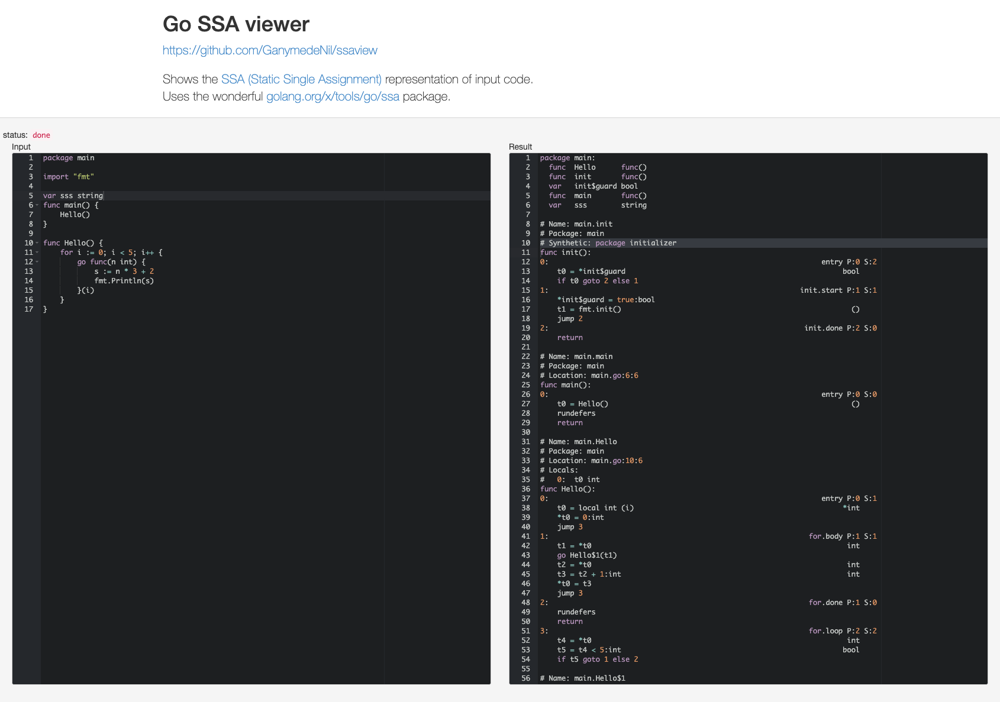

# ssaview
This project is an upgraded maintenance version of tmc's [ssaview](https://github.com/tmc/ssaview) project.

ssaview is a small utlity that renders SSA code alongside input Go code

## Install & Run
```bash
 $ go get github.com/GanymedeNil/ssaview
```
### web server mode
```bash
  $ ssaview
  $ open http://localhost:8080/
```
Runs via HTTP on :8080

### command mode
```bash
$ ssaview -run-mode command -file-path ./test.go
```

## What's been updated
- Go Modules support
- Building SSA programs using a new approach
- Support for parsing nested closures
- Supports both command line and web service usage

## Screenshot:


 